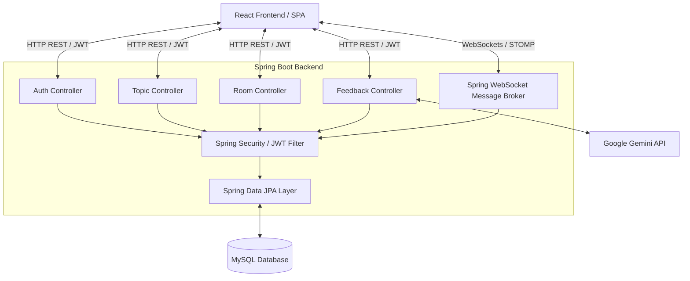
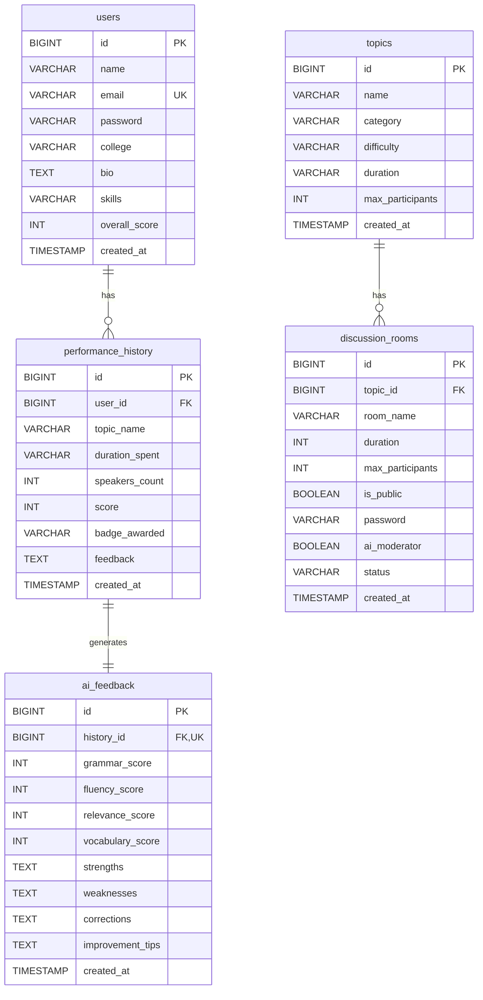

# GDVerse: AI-Powered Mock Group Discussion Platform
## Complete Technical Documentation & Interview Discussion Guide

GDVerse is a full-stack web application designed to help students and job aspirants practice mock group discussions (GDs). It provides a simulated virtual room environment with an **AI Moderator**, tracks speech metrics (relevance, fluency, vocabulary, grammar), and generates granular, download-ready AI performance reports.

This document serves as a comprehensive project guide, detailing the architecture, database schema, codebase structure, individual file implementations, API contracts, system flows, and common interview questions.

---

## 1. System Architecture & Tech Stack

GDVerse is built using a decoupled client-server architecture:



### Technology Stack
*   **Frontend**: React (v19), Vite (v8), Vanilla CSS (Glassmorphism layout), and `jspdf` (for client-side PDF generation).
*   **Backend**: Spring Boot (v3.2.5), Java 17, Spring Security (JWT stateless authentication), Spring WebSocket (STOMP protocol over SockJS broker), Spring Data JPA, and Hibernate.
*   **Database**: MySQL (relational database storing users, rooms, topics, histories, and AI metrics).
*   **AI Integration**: Google Gemini API integration (for topic generation and transcript evaluations).

---

## 2. Project Directory Structure

```text
GDVerse/
│
├── gdverse-backend/                 # Spring Boot Backend
│   ├── pom.xml                      # Maven Dependencies & Build Configuration
│   └── src/main/
│       ├── java/com/gdverse/
│       │   ├── GdverseApplication.java  # Main Bootloader Class
│       │   ├── config/              # Configuration files (Security, WebSockets)
│       │   ├── controller/          # REST Endpoints (Auth, Rooms, Topics, Feedback)
│       │   ├── model/               # JPA Entities (User, Room, Topic, Feedback, etc.)
│       │   ├── repository/          # Spring Data JPA Interfaces
│       │   └── security/            # Security Filters, UserDetails & JWT Providers
│       └── resources/
│           ├── application.yml      # App settings, DB connections, JWT & API keys
│           └── schema.sql           # Database schema initialization script
│
└── gdverse-frontend/                # React Frontend
    ├── package.json                 # Node modules & Vite command scripts
    ├── vite.config.js               # Vite plugin configs
    ├── index.html                   # HTML entry point (incorporating FontAwesome/Fonts)
    └── src/
        ├── main.jsx                 # React DOM bootstrapper
        ├── App.jsx                  # Root App Router & Global State manager
        ├── views.jsx                # Component Catalog (Contains all UI screen views)
        ├── App.css                  # Core CSS variables/resets
        └── index.css                # Glassmorphic responsive styling framework
```

---

## 3. Database Schema Design

The application schema consists of 5 core tables mapped using JPA relationships:



### Table Definitions & Relations
1.  **`users`**: Stores user profiles. Has a `One-to-Many` relation with `performance_history`.
2.  **`topics`**: Standard bank of GD topics (e.g., Tech, Finance, Social). Has a `One-to-Many` relation with `discussion_rooms`.
3.  **`discussion_rooms`**: Active GD rooms. Tracks status (`ACTIVE` vs. `COMPLETED`) and passwords for private rooms.
4.  **`performance_history`**: Tracks summaries of completed discussions for a user.
5.  **`ai_feedback`**: Stores granular sub-scores. Maps `One-to-One` with a `performance_history` record.

---

## 4. Backend Implementation Details

### A. Configuration Layer (`com.gdverse.config`)
*   [SecurityConfig.java](file:///c:/Users/srush/OneDrive/Desktop/Folders/Java%20Full%20Stack%20projects/GDVerse/gdverse-backend/src/main/java/com/gdverse/config/SecurityConfig.java)
    *   **Purpose**: Configures Spring Security for REST API protection.
    *   **Details**:
        *   Disables CSRF and CORS for easy testing.
        *   Enforces stateless session management (`SessionCreationPolicy.STATELESS`).
        *   Permits unauthenticated requests to `/api/auth/**` (login/register) and `/ws/**` (WebSockets).
        *   Secures all other endpoints (`/api/rooms/**`, `/api/topics/**`, `/api/feedback/**`) using a custom [JwtAuthenticationFilter](file:///c:/Users/srush/OneDrive/Desktop/Folders/Java%20Full%20Stack%20projects/GDVerse/gdverse-backend/src/main/java/com/gdverse/security/JwtAuthenticationFilter.java).
        *   Exposes `BCryptPasswordEncoder` as a bean for password hashing.
*   [WebSocketConfig.java](file:///c:/Users/srush/OneDrive/Desktop/Folders/Java%20Full%20Stack%20projects/GDVerse/gdverse-backend/src/main/java/com/gdverse/config/WebSocketConfig.java)
    *   **Purpose**: Configures WebSocket messaging for real-time room communication (chat, queue management, status updates).
    *   **Details**:
        *   Uses **STOMP** sub-protocol.
        *   Registers the `/ws` endpoint for client handshakes (with SockJS fallback enabled).
        *   Configures an in-memory message broker with prefix `/topic` for server-to-client broadcasts.
        *   Sets prefix `/app` for client-to-server destination routing.

### B. Security & Authentication Layer (`com.gdverse.security`)
*   [JwtTokenProvider.java](file:///c:/Users/srush/OneDrive/Desktop/Folders/Java%20Full%20Stack%20projects/GDVerse/gdverse-backend/src/main/java/com/gdverse/security/JwtTokenProvider.java)
    *   **Purpose**: Handles JWT token construction and validation.
    *   **Details**: Generates a token signed with the `HS256` signing key using a custom secret (`gdverse.security.jwt.secret`). Validates incoming token expirations and extracts user email claims.
*   [JwtAuthenticationFilter.java](file:///c:/Users/srush/OneDrive/Desktop/Folders/Java%20Full%20Stack%20projects/GDVerse/gdverse-backend/src/main/java/com/gdverse/security/JwtAuthenticationFilter.java)
    *   **Purpose**: Intercepts request flows, extracting the JWT from the `Authorization: Bearer <token>` header.
    *   **Details**: If the token is valid, it loads user details from `UserDetailsServiceImpl` and registers authentication credentials directly inside Spring's `SecurityContextHolder`.
*   [UserDetailsServiceImpl.java](file:///c:/Users/srush/OneDrive/Desktop/Folders/Java%20Full%20Stack%20projects/GDVerse/gdverse-backend/src/main/java/com/gdverse/security/UserDetailsServiceImpl.java)
    *   **Purpose**: Connects Spring Security to the database.
    *   **Details**: Implements `UserDetailsService`, retrieving user data via `UserRepository.findByEmail()` and packing it into a standard `UserDetails` object.

### C. Repository Layer (`com.gdverse.repository`)
Standard interface declarations extending `JpaRepository`:
*   [UserRepository.java](file:///c:/Users/srush/OneDrive/Desktop/Folders/Java%20Full%20Stack%20projects/GDVerse/gdverse-backend/src/main/java/com/gdverse/repository/UserRepository.java): Query by `email`.
*   [TopicRepository.java](file:///c:/Users/srush/OneDrive/Desktop/Folders/Java%20Full%20Stack%20projects/GDVerse/gdverse-backend/src/main/java/com/gdverse/repository/TopicRepository.java): Query categories or find topics containing search text.
*   [RoomRepository.java](file:///c:/Users/srush/OneDrive/Desktop/Folders/Java%20Full%20Stack%20projects/GDVerse/gdverse-backend/src/main/java/com/gdverse/repository/RoomRepository.java): Query active, public rooms.
*   [PerformanceHistoryRepository.java](file:///c:/Users/srush/OneDrive/Desktop/Folders/Java%20Full%20Stack%20projects/GDVerse/gdverse-backend/src/main/java/com/gdverse/repository/PerformanceHistoryRepository.java): Fetch user history records ordered chronologically.
*   [FeedbackRepository.java](file:///c:/Users/srush/OneDrive/Desktop/Folders/Java%20Full%20Stack%20projects/GDVerse/gdverse-backend/src/main/java/com/gdverse/repository/FeedbackRepository.java): Query evaluation details mapped to history IDs.

### D. REST Controllers (`com.gdverse.controller`)
*   [AuthController.java](file:///c:/Users/srush/OneDrive/Desktop/Folders/Java%20Full%20Stack%20projects/GDVerse/gdverse-backend/src/main/java/com/gdverse/controller/AuthController.java)
    *   **Endpoints**:
        *   `POST /api/auth/register`: Hashes passwords via `PasswordEncoder` and registers users.
        *   `POST /api/auth/login`: Validates password matches and returns a JWT token.
        *   `GET /api/auth/validate`: Validates current tokens.
*   [RoomController.java](file:///c:/Users/srush/OneDrive/Desktop/Folders/Java%20Full%20Stack%20projects/GDVerse/gdverse-backend/src/main/java/com/gdverse/controller/RoomController.java)
    *   **Endpoints**:
        *   `GET /api/rooms/active`: Fetches available rooms.
        *   `POST /api/rooms`: Creates a discussion room.
        *   `POST /api/rooms/{roomId}/join`: Joins a room, verifying password credentials if private.
        *   `POST /api/rooms/{roomId}/leave`: Triggers cleanup and records session completion.
*   [TopicController.java](file:///c:/Users/srush/OneDrive/Desktop/Folders/Java%20Full%20Stack%20projects/GDVerse/gdverse-backend/src/main/java/com/gdverse/controller/TopicController.java)
    *   **Endpoints**:
        *   `GET /api/topics`: Fetches the bank of topics.
        *   `GET /api/topics/search?q=...`: Searches topics.
        *   `POST /api/topics/generate-ai`: Receives a keyword and coordinates with Gemini API templates to formulate a mock discussion topic.
*   [FeedbackController.java](file:///c:/Users/srush/OneDrive/Desktop/Folders/Java%20Full%20Stack%20projects/GDVerse/gdverse-backend/src/main/java/com/gdverse/controller/FeedbackController.java)
    *   **Endpoints**:
        *   `GET /api/feedback/history/{userId}`: Retrieves the user's historical performance card summary.
        *   `GET /api/feedback/report/{historyId}`: Returns detailed ratings (grammar, fluency, relevance).
        *   `GET /api/feedback/report/{historyId}/download`: Generates a PDF byte stream on the fly.
        *   `POST /api/feedback/evaluate-speech`: Receives live user transcript feeds and evaluates scores for grammatical accuracy, fluency, vocabulary depth, and contextual topic relevance.

---

## 5. Frontend Implementation Details

The React frontend operates as a stateful Single Page Application structured across two files:

*   [App.jsx](file:///c:/Users/srush/OneDrive/Desktop/Folders/Java%20Full%20Stack%20projects/GDVerse/gdverse-frontend/src/App.jsx): Main state container. Manages the active view state (`landing`, `dashboard`, `live_room`, etc.), user profile context, dark-mode styling switches, custom bookmark trackers, notification panels, and standard layout frames.
*   [views.jsx](file:///c:/Users/srush/OneDrive/Desktop/Folders/Java%20Full%20Stack%20projects/GDVerse/gdverse-frontend/src/views.jsx): A modular repository of functional components defining the app's visual structure.

### Core Frontend Views & Features

1.  **`LandingPage`**: Entry interface showing product features, service metrics, and interactive FAQs.
2.  **`Auth`**: Login and Sign-up forms including multi-step flows like OTP email verification.
3.  **`Dashboard`**: Hub containing progress charts, cumulative speaker scores, and shortcuts to recommended topics and active rooms.
4.  **`TopicLibrary`**: Features categorized cards (Current Affairs, Startups, Finance, Technology) and dynamic bookmarks.
5.  **`CreateRoom` & `JoinRoom`**: Interfaces to configure and list discussion spaces (AI moderator toggle, duration, participants limit, public vs. password-secured private lobbies).
6.  **`LiveRoom` (The Discussion Simulator)**:
    *   **Visualizer**: Grid cards highlighting the active speaker.
    *   **Speaking Queue**: A queue registry allowing participants to raise hands and secure talking slots.
    *   **AI Moderator HUD**: Monitors speech pace (WPM), vocabulary density, and confidence markers in real-time.
    *   **Live Speech Transcription**: Uses the Web Speech API (transcribing microphone input to text in real-time).
7.  **`AiFeedbackPage`**: Interactive dashboard displaying post-discussion metrics. Includes radar/bar charts, lists of strengths/weaknesses, and concrete grammar corrections.
8.  **`PracticeMode`**: A single-player sandbox where the user talks against an automated AI moderator. The moderator posts prompts, and the user responds via speech to refine arguments.

---

## 6. End-to-End Core User Flow

The following lifecycle outlines how data travels through GDVerse:

```text
[User Registration/Login]  
       │
       ▼ (Validates credentials & returns JWT)
[Select Topic / Create Room] ──► (Configure topic difficulty, duration, and AI moderator)
       │
       ▼ (Initializes WebSocket connection over '/ws' handshake)
[Participate in Mock GD]  
       │
       ├─► [Speak Session] ──► Uses Web Speech API to transcribe user speech to text
       ├─► [Real-time Chat] ─► Broadcasts text transcripts to room members via WebSocket '/topic/rooms'
       └─► [AI Moderator] ──► Tracks speech pace, vocabulary density, and topic relevance in real-time
       │
       ▼ (Leaves Room / Triggers evaluation endpoint)
[Generate Performance Report] ──► Backend evaluates transcript data
       │
       ├──► Stores score history in 'performance_history' and 'ai_feedback' MySQL tables
       └──► Client downloads detailed performance summary as PDF (utilizing 'jspdf')
```

---

## 7. Interview Discussion & Q&A Cheatsheet

Prepare for project evaluation and interview questions with these responses:

#### Q1: Why did you use WebSockets instead of standard REST polling for discussion rooms?
> **Answer**: Real-time group discussions require low-latency communication. HTTP polling would require client browsers to query the database every second for chat messages and speaking queues, creating high server overhead. WebSockets establish a single persistent TCP connection. Using Spring's STOMP broker, we broadcast state changes (e.g., chat, queue, speech status) with sub-second latency, reducing database requests.

#### Q2: How is security handled in this application?
> **Answer**: The application uses stateless JWT authentication. When users log in, the backend verifies their password (stored as a BCrypt hash in MySQL) and returns a signed JWT containing their email. The client stores this token (usually in LocalStorage or an HttpOnly cookie). 
> Every subsequent API request includes this token in the `Authorization: Bearer <token>` header. A custom [JwtAuthenticationFilter](file:///c:/Users/srush/OneDrive/Desktop/Folders/Java%20Full%20Stack%20projects/GDVerse/gdverse-backend/src/main/java/com/gdverse/security/JwtAuthenticationFilter.java) extracts the token, validates the signature, and sets the user context in Spring's `SecurityContextHolder`.

#### Q3: How are the database tables related in Spring Data JPA?
> **Answer**: We modeled relations using JPA annotations:
> *   `User` has a `@OneToMany` relationship with `PerformanceHistory`.
> *   `Topic` has a `@OneToMany` relationship with `Room`.
> *   `PerformanceHistory` has a `@OneToOne(mappedBy = "performanceHistory", cascade = CascadeType.ALL)` relationship with `Feedback`.
> To prevent infinite recursion in JSON serialization, we used `@JsonManagedReference` on the parent sides and `@JsonBackReference` on the child sides, or mapped DTO objects to decouple the database entities from the REST APIs.

#### Q4: How is speech transcription and AI evaluation implemented?
> **Answer**: Transcription uses the HTML5 Web Speech API (`webkitSpeechRecognition`) on the frontend to capture microphone input and convert it to text in real-time. 
> For evaluation, the transcript is sent to the backend `/api/feedback/evaluate-speech` endpoint. The backend coordinates with the Gemini API (using a structured prompt template) to analyze the text for grammar corrections, vocabulary complexity, topic relevance, and fluency, returning a structured JSON payload of scores and feedback text.

#### Q5: What database index optimizations did you implement?
> **Answer**: We indexed columns used frequently in search and join operations:
> *   `users.email` has a unique constraint, which implicitly creates an index for rapid credential lookups.
> *   Foreign key columns (`user_id` in `performance_history` and `history_id` in `ai_feedback`) are indexed to speed up queries for user dashboards and historical reports.
